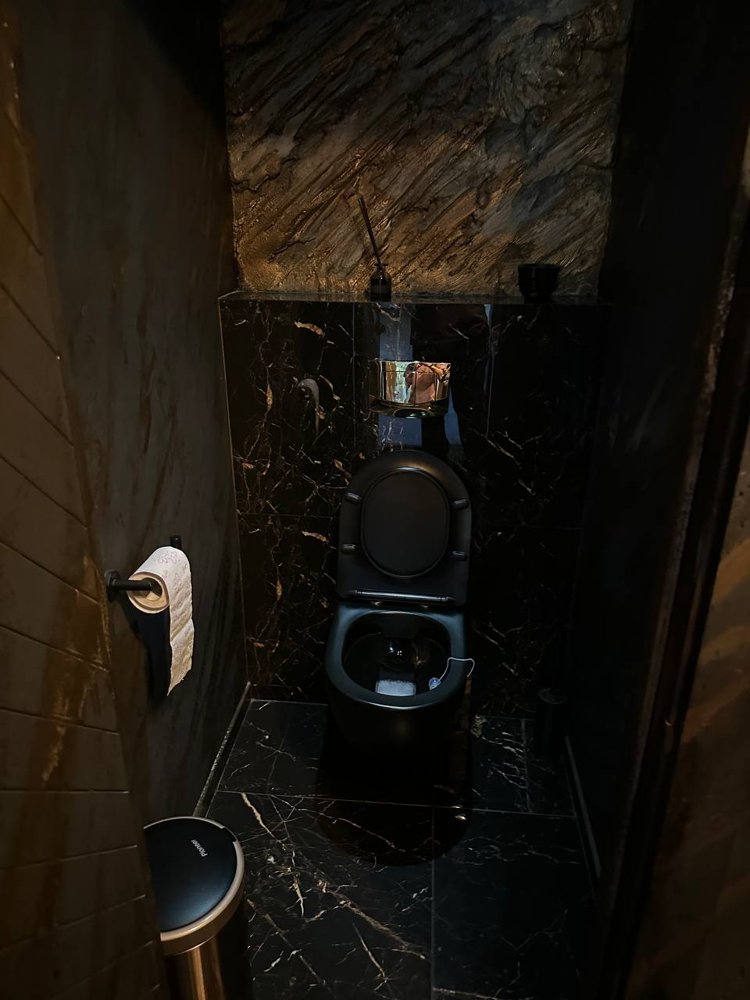

# IT Идеальные дни

Я не умею отдыхать, мой понедельник начинается в субботу. Для меня выходные — это не пляж и коктейли, а пет-проект и шум вентиляторов ноутбука. Море мне заменяет бульканье воды в колбе кальяна, но чайки у менять есть, они постоянно кричат: «Когда таска? А когда? А когда?»

Вообще говорят что отдых — это смена обстановки. Вот, например, год назад я вместо того чтобы поработать из питерского офиса, поехал в московский. Ну а что, четыре часа в пути на сапсане — отличное время, когда тебя никто не трогает.

Зашел я в офис уже вечером, офис пустой, кроме соседнего стола, там сидел Рукль, он каждые 15 минут выходит покурить. Я подумал ага, отличная жертва для кальяна и философских бесед.

Но он сказал кальяны в его городе удел маргиналов, а он мужчина серьезный женится и поэтому все его мысли заняты свадебной вечеринкой..

Я уже подумал, что он утащет меня в свое свадебное болото, а я только только из питерского выбрался. И вообщее у нас про таких говорят 'ты променял нашу философскую жизнь на баб'.

Но оказалось, что он хотел найти бар под вечеринку, поэтому у него уже есть маршрут из 4 баров по которым надо пройтись. Ну не кальянка, но тоже пойдет и я согласился!

Искал он бар похожий на Твин Пикс, что-то между Черным фигвамом и авангардным искусством.

Первый оказался закрыт, поэтому нам удалось обсудить что такое любовь. У Рукля на этот счет есть целая теория с действиями разного порядка, и даже больше у него со времен студенчества есть целые зарисовки схем взаимоотношения между людьми в заметках на телефоне. Сократ про таких говорил 'Всегда женись, хорошая жена - счастливая жизнь, а если плохая - станешь философом'.

Второй бар был больше похож на поезд стрипушник: зеленые плафоны ламп и куча дискошаров. Как будто заведение затянуло аб тесты и так не решилось про что они.
Рукль сказал что у него есть лайфхак как выбрать быстро коктели, поэтому мы попросили самый лучший их коктейл за которым все приходят.

минуту спустя у нас 2 красных бокала, половину которого занимает брус льда, Рукль делает глоток и..
  
— Остро... — хрипит он.

— Ну да, это же кровавая мери...

— Я ненавижу острые коктейли.

— Так а зачем тогда мы их взяли?

— Это же их фишка

Просит официанта провести к туалету, я подумал что все на столько плохо и я предупредил, что волосы держать я не буду. Иду с ними, он открывает дверь и достает телефон и начинает делать фотографию. Он видя что ни я ни официанта не выкупают что происходит говорит

— Туалет самая важная часть вечеринки. Представьте, девушка на каблуках идёт припудрить носик, а там — люк в подвал, в который нужно спускаться по стремянке, после чего понимаешь что и спускаться не надо было, потому что это все просто большая выгребная яма, а ты уже по щиколотку в луже неизвестного происхождения... а фото, просто чтобы не забыть

— У нас свадьба просто, говорю я официантке

— В смысле у вас?

Повисла неловкая пауза...

— Не не, не подуймайте, мы за традиционные ценности, у него свадьба, мы просто помещение выбираем... Мы, наверное, все, пойдем дальше, спасибо!

Когда нас не пустили в третий бар охраники, я начал думать, что весь город уже оповещен о странной парочке извращенцев, но они сказали, что 'в трениках' нельзя, у них дресскот и покосились взглядом на Рукля. 

— а можно позвать администратора, мы хотим организовать мероприятие у вас. Вот представляешь, Кирилл. Понравятся тебе единственный раз в жизни штаны за 25к у Томми Хилфигера, а потом тебе говорят что это треники

На что удивился даже я, потому что не будь там логотипа, я бы счел это некачественной копией абибаса с рынка. Эх, высокая мода, никогда не угадаешь где гопота, а где Гоша рубчинский.

Администратор с радостью нас впустила. Вот этот бар был чисто из Твин Пикса, хаотичный интерьер, как будто бы там даже есть свои карлики нухнувшие пару дорожек в туалете. Кстати о нем. Туда вела винтовая лестница в полуподвал с 2 кабинками, и ровно между них был засунут банкомат. Тот самый банкомат из 2010, когда можно было пополнить через qiwi свой телефон.

Собственно это стало минусиком в их карме, поэтому мы двинулись в четвертый бар.

Но и там нас охраники пустили только вместе с хозяйном. Я в шутку сказал что мы больше похоже на санэпидем станцию. Ходим в трениках, нас не пускают, а после обхода помещения с администрацией мы фотографируем туалеты и уходим не выпив ни глотка.

Этот бар больше напоминал атмосферу великого гэтсби, но зато все было прилично ухожено и не забыв сделать заветный чекин в мужском кабинете, вышли на улицу. Это был последний.

Мы поняли, что программа выпить у нас не удалась, зато нашли подходящий под вечеринку бар, поэтому можем со спокойной совестью забуриться в кальянную.

И вот сидим мы в кальянной, сортируем сортиры, пускаем дым колечками и я понимаю: может, любовь — это не про 'она та самая', а про то, чтобы найти человека, который будет так же одержим проверкой туалетов в барах. 

Поэтому в следующий раз, увидев на баре «Выбор Яндекса 2025», знайте: это не всегда про еду и напитки. Это про то, что их туалет прошёл проверку двумя IT-специалистами, один из которых чуть не умер от коктейля, а второй хранит фото сортиров, как NFT.

