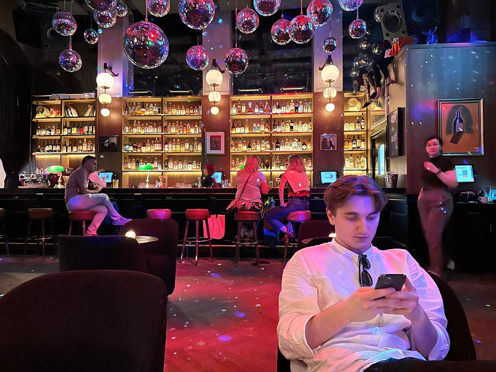
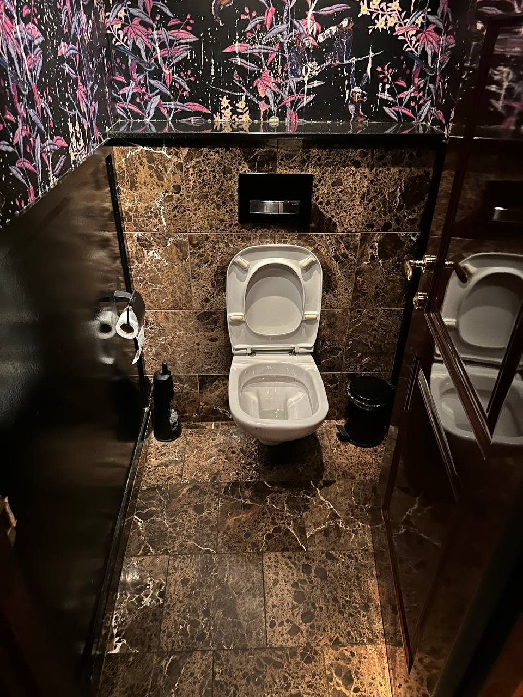
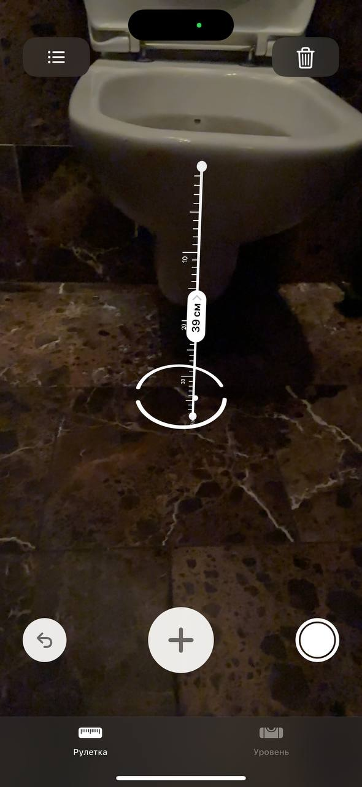
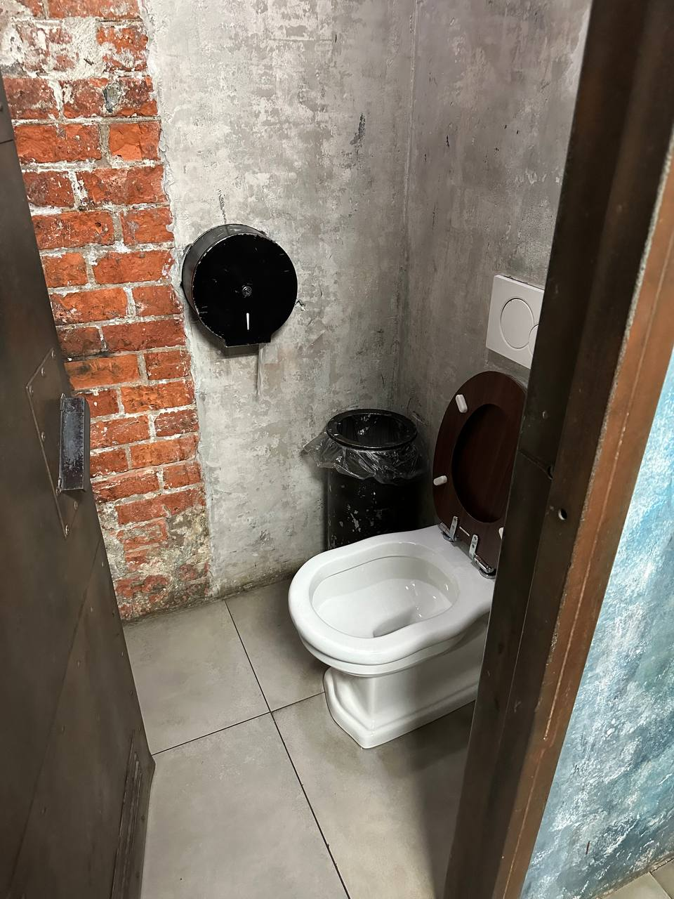

# IT Идеальные дни

Я не умею отдыхать. Для меня выходные — это не пляж и коктейли, а пет-проект и шум вентиляторов ноутбука. Море мне заменяет бульканье воды в колбе кальяна, а крики чаек — вопросы коллег: «Когда таска? А когда? А когда?»

----

Мы все пишем код, который кто-то использует. Кнопка такси, кнопка перевода — не дом построить. Хотя дом у нас есть. Даже два: один реальный, второй — виртуальный, чтобы следить за первым. Говорят, нас заменят ИИ. Пф. Когда нейросети научатся верстать кнопки, мы будем пилить чат, где с ними можно ругаться из-за багов. Работа найдется.

А видели ли вы как пользуются этой кнопкой? Строители тоже научились делать кнопки, например у калиткот, чтобы выйти из территории дома. Так вот мне довелось наблюдать что случается когда она перестает работать. И знаете что? Это полностью описывает как устроены корпоративные процессы создания этих кнопок!

Потому что в тот момент когда кнопка перестает работать, люди превращаются в горил и начинают дергать калитку, думая что если привычный процесс нарушен получится силой и криками.

Но самое прекрасное — это командная работа. Если человек один, он начинает бегать туда-сюда, как белка в колесе: нажал — побежал проверить — не открылось — нажал сильнее… Если их двое, включается коллективный разум: один давит на кнопку, второй дёргает створку. Но корпорации считают что каждый сотрудник должен быть заменяемым, поэтому минимальная команда это 3 человека.

А если их трое - это уже полноценный Agile-спринт. Третий сначала снисходительно наблюдает, потом решает, что первые два — идиоты, лезет сам… и если у него получается, весь день будет их унижать, ровно как тимлид после удачного деплоя.

Теперь я смотрю на эту калитку и понимаю: вся наша работа — это попытки открыть дверь, которая заела. Кто-то дёргает, кто-то бегает, кто-то делает вид, что так и надо… А те, кто прошёл, просто уволились и вышли в другой двор.

И всегда забавно наблюдать за этим абсурдом. Мы организовываемся в большие кучки людей, где половина больше мешает чем помогает. И кажется что мы отдыхаем именно от этого. От абсурда..

----

Говорят, отдых — это смена обстановки. Лид как-то предложил «проветриться» — пройтись по барам. «Как мило, — подумал я, — компания заботится о моём ментальном здоровье».

Как бы не так. Оказалось, он искал бар для свадьбы. С ТЗ, конечно: «Что-то между "Чёрным фигвамом" и авангардным искусством. Как "Твин Пикс", но чтобы гости не сбежали».

Бар #1 — закрыт. «Знак свыше», — подумал я. «Нет, просто 11 утра», — отвечает лид.

Бар #2 — заказываем самый популярный коктейль (кажется на работе мы по такому же принципу выбираем библиотеки). Приносят две «Кровавые Мэри». Лид сразу морщится: «Ненавижу острые коктейли!» — «Ты сам их заказал!» — «Ну все же пьют...». Классический корпоративный подход.

Официант ведёт нас к сортиру. Я уже готовлюсь держать лиду волосы (на всякий случай предупреждаю: «Ты знаешь, я не в том отношениях, чтобы вот так вот…»), но вместо рвотных позывов — сюрприз. Лид вдруг достаёт телефон и начинает фоткать дверь.

— Туалет — самая важная часть вечеринки, — серьёзно говорит он, видя наши недоумённые лица. — ТЗ внезапно дополнилось.

Представьте: девушка в вечернем платье идёт «припудрить носик», а там — люк в подвал со стремянкой. Ты уже спускаешься, а потом понимаешь, что это не туалет, а большая выгребная яма. И ты уже по щиколотку в луже неизвестного происхождения… А фото — чтобы не забыть.

— Ты вообще в адеквате? — спрашиваю я. — Только не скидывай это нам на ретро, чтобы метафорично сказать что мы в очередной раз в говне.

— В том-то и дело! — оживляется он. — На работе мы месяцами тестируем кнопки, которые никто не нажимает. А тут — реальный юзкейс! Девушка на каблуках, подвыпившие гости, стресс… Если туалет переживёт это — он переживёт всё. Как наше legacy, которое работает на честном слове. 

Я держу пальцы крестиком, хоть бы не достал сейчас каблуки.. хоть бы не достал каблкуки.. я не собираюсь тестить еще и их!

Официантка смотрит на нас, как на психов. Я, чтобы как-то спасти ситуацию, бросаю:

— У нас свадьба!

— В смысле, у… вас?

— Нет-нет, мы за традиционные ценности! У него свадьба, мы просто локацию выбираем… Всё, мы пошли, спасибо!

Бар #3 — охрана не пускает. Я начал думать, что весь город уже оповещен о странной парочке айти извращенцев, но оказалось «В трениках нельзя». Лид возмущённо тыкает в свои штаны за 25к («Tommy Hilfiger, ё-моё!»). Высокая мода — никогда не угадаешь, где гопота, а где Гоша Рубчинский.

Под изначальное тз подходило, но о ужас - винтовая лестница в туалет, а между кабинками... банкомат. Тот самый, из 2010-го, где можно было пополнить телефон через QIWI. «Эх, были времена», — вздыхаю я, делая чек-ин в мужской комнате.

Бар #4 охрана пускает только с администратором. «Мы похожи на санэпидемстанцию, — шучу я. — Ходим по барам, фоткаем сортиры, ничего не пьём».

В итоге — ноль алкоголя, зато NFT коллекция сортиров и кальянная в качестве финальной точки. Сидим, пускаем кольца дыма.

И как всегда, мы остановились на последнем варианте, потому что просто устали. Если посмотреть на тз, то авангардом там и не пахло, как всегда победило что-то обычное. Зато много сортиров!

Поэтому в следующий раз, увидев на баре «Выбор Яндекса 2025», знайте: это не всегда про еду и напитки. Это про то, что их туалет прошёл проверку двумя IT-специалистами, один из которых чуть не умер от коктейля, а второй хранит фото сортиров, как современное искусство.

----

Камю писал про Сизифа — того, кто катит камень в гору. Философ считал его счастливым: он осознаёт абсурд, но продолжает. Всё без цели, но с затратой сил — и есть творчество.

Мой отдых — устать, наслаждаясь абсурдом. Иногда в туалетах баров отдыхаешь больше, чем от коктейлей.
